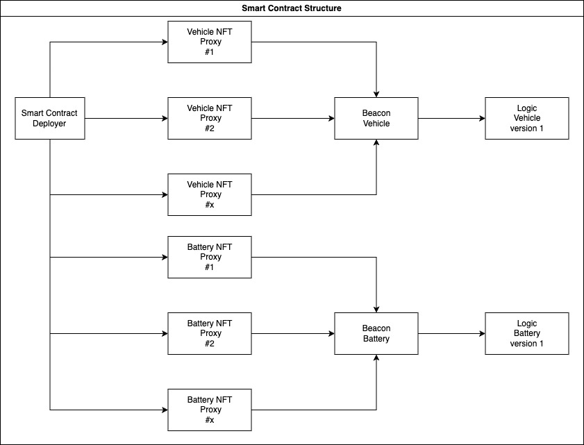

# Cara7 Contracts

## Table of contents

- [Intro](#intro)

* [General info](#general-info)

* [Smart-contracts structure](#smart-contracts-structure)

* [Diagram](#structure-diagram)

* [Deployed contract](#deployed-contract)

* [Contracts info](#contracts)

* [Instalation](#instalation)

* [Foundry](#foundry)

## Intro

Contracts for Vehicle & Battery passport.

## General info

### Smart-contracts structure

Each proxy is an NFT so we can retrieve easely a specific NFT. This can be achieve by the deployer contract that create each proxy with the create2 opcode.

- **Deployer**: Contracts that deploy 2 sorts of proxy _Vehicle_ and _Battery_ at determistic address and the possibility to retrieve contract address with specific parameters.

- **Authorization**: Contract for authorization access that store address that can add events for _Vehicle_ and _Battery_ passport.

- **Vehicle**:

  - **VehicleLogic**: This contract consit of the logic behind the vehicle NFT passport.
  - **VehicleBeacon**: This contract consist to link the proxy to the corresponding logic.
  - **VehicleProxy**: This proxy contract serve to be deployed at minimum cost and uppgreadable and represent the Vehicle passport.

- **Battery**:
  - **BatteryLogic**: This contract consit of the logic behind the battery NFT passport.
  - **BatteryBeacon**: This contract consist to link the proxy to the corresponding logic.
  - **BatteryProxy**: This proxy contract serve to be deployed at minimum cost and uppgreadable and represent the Battery passport.

### Structure Diagram



## Deployed contract

| Nom du Contrat | Adresse du Contrat                           | Lien vers l'Explorateur                                                                                      |
| -------------- | -------------------------------------------- | ------------------------------------------------------------------------------------------------------------ |
| Deployer       | `0x78aaAcd84F0336671C45B17B683851077034ddEa` | [Voir sur explorer xrplevm](https://explorer.xrplevm.org/address/0x78aaAcd84F0336671C45B17B683851077034ddEa) |
| Authorization  | `0x2A9F6B5b6c0a51B804Fcd044C86Bfd19Ab042124` | [Voir sur explorer xrplevm](https://explorer.xrplevm.org/address/0x2A9F6B5b6c0a51B804Fcd044C86Bfd19Ab042124) |
| Beacon Vehicle | `0x5D2Ae7da2c74dCe17Aca6F2480e01405aa145E27` | [Voir sur explorer xrplevm](https://explorer.xrplevm.org/address/0x5D2Ae7da2c74dCe17Aca6F2480e01405aa145E27) |
| Beacon Battery | `0x04198Da884AaCBfBd437f2cDCf1C48ebAa81ab66` | [Voir sur explorer xrplevm](https://explorer.xrplevm.org/address/0x04198Da884AaCBfBd437f2cDCf1C48ebAa81ab66) |

## Contracts

### Deployer

The Deployer Smart Contract is designed to facilitate the deployment and recreation of proxy contracts. Instead of maintaining a registry of addresses, this contract can deterministically recreate the addresses of proxies.

- deployProxyVehicle: Create a proxy vehicle
- deployProxyBattery: Create a proxy battery
- computeProxyVehicleAddress: Get the address of a proxy vehicle
- computeProxyBatteryAddress: Get the address of a proxy battery

### Athorization

The Authorization Smart Contract is designed to manage access control, enabling specific functions to be accessible only to authorized address.

- authorize: Add an authorization for an address
- unauthorize: Remove an authorization for an address
- isAuthorized: Return if an address as authorization

### Beacon

The Beacon Smart Contract serves as a centralized reference for proxies, enabling them to dynamically link to the correct logic contract. This design pattern allows proxies to point to a single, updatable contract for business logic, ensuring they are always using the latest version without redeployment.

### Link a battery passport to vehicle

The battery logic have 2 way to transfer the NFT to the vehicle passport.

`mint` function check if the receiver address is a contract if its a contract it will trigger the fonction from the vehicle contract `onBatteryReceived`

```
function mint(
    address to,
    string memory batteryId,
    string memory manufacturer,
    string memory batteryStatus,
    uint256 productionDate
  ) external onlyOwner {
    _mint(to, 1);
    _setMetadata(batteryId, manufacturer, batteryStatus, productionDate);
    if (_checkAddressIsContract(to)) {
      IVehicle(to).onBatteryReceived(address(this));
    }
  }
```

`transferToVehicle` is a function didicated to transfer the nft to the vehicle contract and trigger the `onBatteryReceived` function

```
function transferToVehicle(address from, address vehicleContract) external {
    if (
      ownerOf(1) != msg.sender &&
      IAuthorization(_authorizationContract).isAuthorized(msg.sender) == false
    ) revert InvalidCallerNotOwner();
    safeTransferFrom(from, vehicleContract, 1);
    IVehicle(vehicleContract).onBatteryReceived(address(this));
  }
```

## Instalation

This repo use Foundry => https://book.getfoundry.sh/

```
git clone git@github.com:CARA7org/cara7-contracts.git
```

```
cd cara7-contracts
```

```
forge install
```

```
forge test -vvv
```

## Foundry

**Foundry is a blazing fast, portable and modular toolkit for Ethereum application development written in Rust.**

Foundry consists of:

- **Forge**: Ethereum testing framework (like Truffle, Hardhat and DappTools).
- **Cast**: Swiss army knife for interacting with EVM smart contracts, sending transactions and getting chain data.
- **Anvil**: Local Ethereum node, akin to Ganache, Hardhat Network.
- **Chisel**: Fast, utilitarian, and verbose solidity REPL.

## Documentation

https://book.getfoundry.sh/

## Usage

### Build

```shell
$ forge build
```

### Test

```shell
$ forge test
```

### Format

```shell
$ forge fmt
```

### Gas Snapshots

```shell
$ forge snapshot
```

### Anvil

```shell
$ anvil
```

### Deploy

```shell
$ forge script script/Counter.s.sol:CounterScript --rpc-url <your_rpc_url> --private-key <your_private_key>
```

### Cast

```shell
$ cast <subcommand>
```

### Help

```shell
$ forge --help
$ anvil --help
$ cast --help
```
